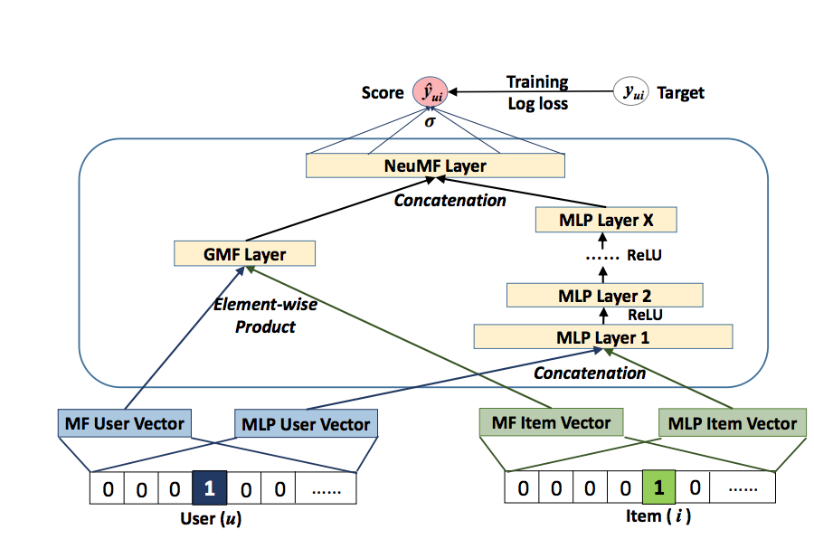

# Recommendation App

This repository contains the implementation of a recommendation system designed to generate personalized product recommendations. The project evolved through multiple phases, incorporating state-of-the-art techniques to improve performance and scalability.

## Project Overview
The project aims to provide:
1. Personalized product recommendations for customers.
2. APIs to manage and retrieve recommendations.
3. Scalability and efficiency for real-time inference.

## Features
- **APIs for Recommendations**: Implemented using FastAPI to support the following functionalities:
  - `customer_recommendations(customer_id)`: Generates recommended products for a customer.
  - `show_recommendations(customer_id)`: Retrieves the recommendations for a specific customer.
  - `update_recommendations(customer_id, product_list)`: Sorts the products based on their scores and updates the recommendations.
  - `delete_recommendations(customer_id, product_list)`: Removes specified products from the recommendations.

## Project Phases

### Phase 1: Initial Implementation with TuriCreate
Initially, the recommendation system was implemented using Apple's **TuriCreate** library. This phase involved:
- Training a recommendation model.
- Developing APIs using **FastAPI** for managing and retrieving recommendations.

You can find the implementation notebook for this phase [here](Notebook/Sales_recommendation.ipynb).

### Phase 2: Neural Collaborative Filtering (NCF)

To improve recommendation quality, a more advanced **Neural Collaborative Filtering** (NCF) approach was implemented. This phase included:
- Building the model from scratch using TensorFlow APIs based on a research article.
- Key components of the NCF model:
  - **String Lookup**: Encoding user and item IDs.
  - **Embedding Layers**: Learning latent factors for users and items.
  - **Generalized Matrix Factorization (GMF)**: Combining user and item embeddings multiplicatively.
  - **Multi-Layer Perceptron (MLP)**: Combining user and item embeddings concatenatively and passing through dense layers.
  - **NeuMF Layer**: Combining GMF and MLP outputs.
  - **Output Layer**: Predicting user-item interaction probability.

You can find the implementation notebook for this phase [here](Notebook/Neural_Collaborative_Filtering.ipynb).

However, this approach faced a bottleneck during real-time inference, as the model struggled to deliver results quickly enough for high-performance requirements.

### Phase 3: TensorFlow Recommenders (TFRS)
To overcome the inference bottleneck, the project migrated to **TensorFlow Recommenders** (TFRS) with **ScaNN** (Scalable Nearest Neighbors). This phase achieved:
- **Significant Performance Improvement**: Real-time inference latency reduced to 3.35 ms ± 618 µs.
- **Ease of Integration**: TFRS simplified the development and scaling of recommendation systems.

You can find the implementation notebook for this phase [here](Notebook/TFRS_click_data.ipynb).

## Challenges and Breakthroughs

### Challenges
1. **Inference Bottlenecks**:
   - The NCF model faced latency issues during real-time predictions.
2. **Scalability**:
   - Handling a growing number of users and products efficiently.
3. **Integration Overhead**:
   - Transitioning between different frameworks required significant effort to adapt existing pipelines.

### Breakthroughs
1. **Improved Performance**:
   - Migrating to TFRS with ScaNN drastically reduced inference time.
2. **Enhanced Recommendation Quality**:
   - The NCF approach improved the quality of recommendations compared to the initial implementation.
3. **Streamlined API Design**:
   - FastAPI provided a flexible and efficient way to expose the recommendation functionalities.

## How to Use

### Prerequisites
- Python 3.8+
- Required libraries: `tensorflow`, `tensorflow-recommenders`, `fastapi`, `uvicorn`

### Installation
1. Clone the repository:
   ```bash
   git clone https://github.com/yourusername/recommendation-app.git
   cd recommendation-app
   ```
2. Install dependencies:
   ```bash
   pip install -r requirements.txt
   ```

### Running the App
Start the FastAPI server:
```bash
uvicorn app.main:app --reload
```
Access the API documentation at `http://127.0.0.1:8000/docs`.

## Future Work
- Further optimization of TFRS models for specific use cases.
- Adding support for more diverse recommendation strategies.
- Exploring hybrid recommendation approaches combining content-based and collaborative filtering techniques.

## Contributing
Contributions are welcome! Please submit a pull request or open an issue for any suggestions or bugs.

## License
This project is licensed under the MIT License.


